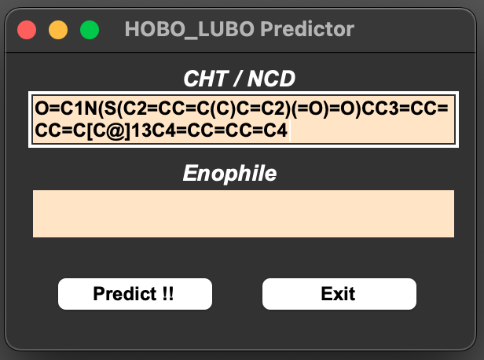
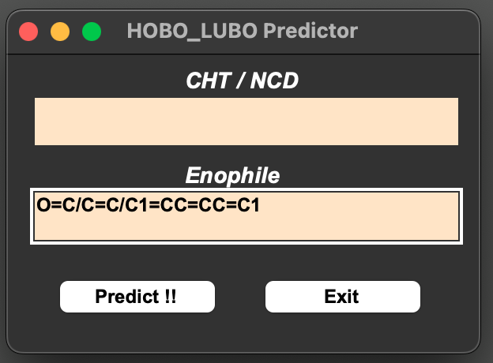
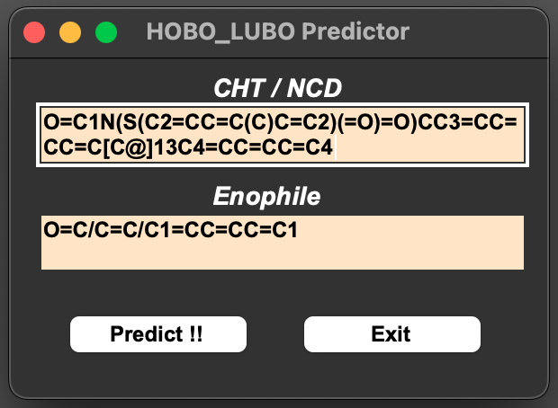
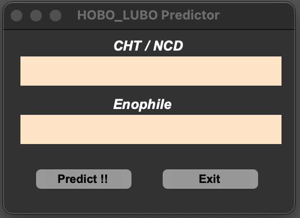
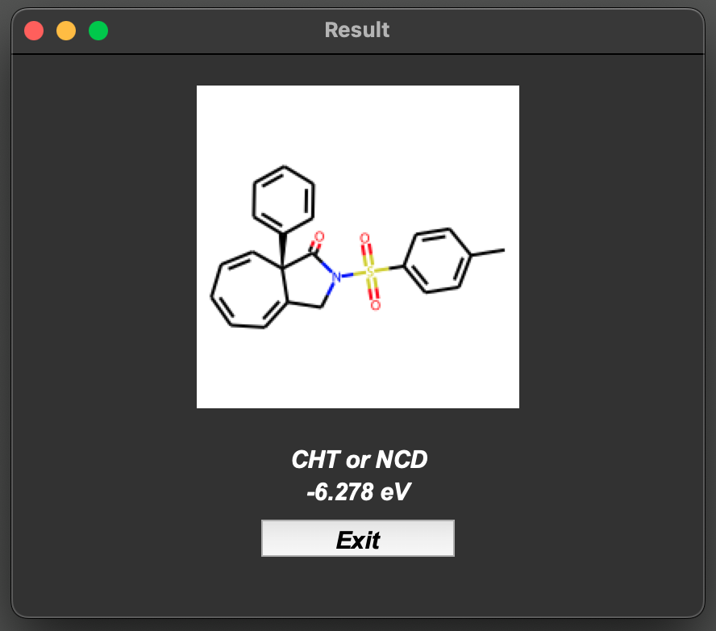
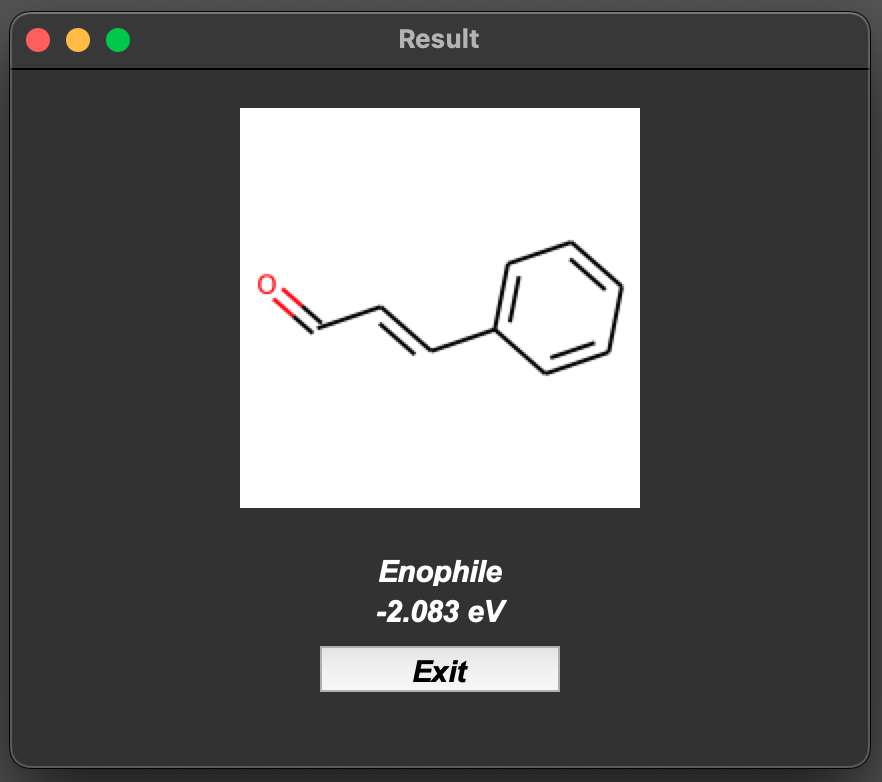
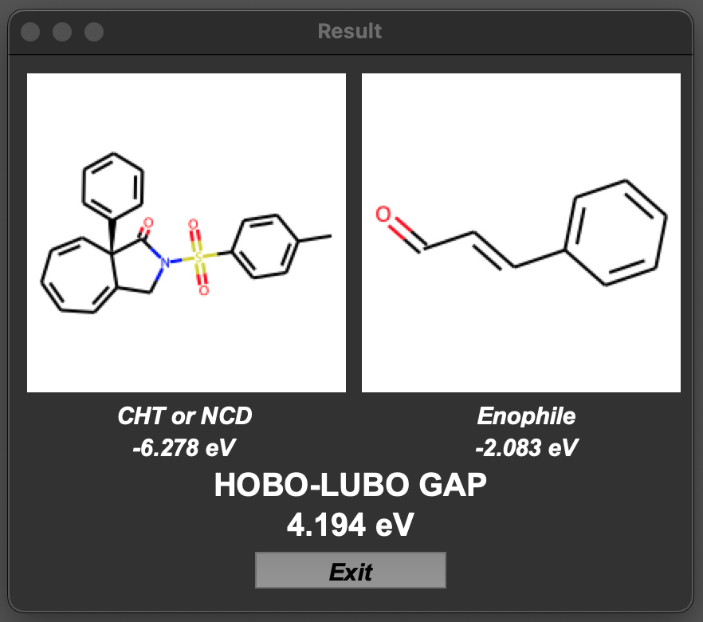
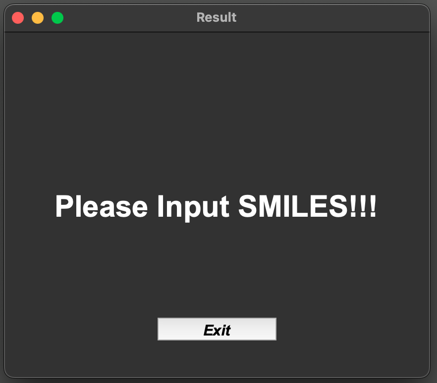

# HOBO_LUBO_Predictor

---
### *Table of contents*
- [*Overview*](#overview)
- [*System_requirements*](#system)
- [*Installation guide*](#installation)
- [*Demo*](#demo)
- [*Instructions_for_use*](#instructions)
- [*Authors*](#authors)
- [*License*](#license)
- [*Contact*](#contact)
---

## Overview

**The HOBO energy level of cycloheptatriene(CHT) and norcaradiene(NCD) scaffolds and the LUBO energy level of enophiles can be predicted by simply inputting the SMILES of the compound.**

---

## System requirements

### 1. All software dependencies and operating systems

  - macOS Monterey 12.3.1 or higher
  - Python 3.10 or higher
  - Numpy
  - Os
  - Pandas
  - Pickle
  - Rdkit
  - Sys
  - Tkinter
  - Warnings

### 2. Versions the software has been tested on

  - macOS Monterey 12.3.1
  - Python 3.10.1
  - Numpy 1.22.3
  - Os
  - Pandas 1.4.2
  - Pickle
  - Rdkit 2022.3.5
  - Sys 
  - Tkinter
  - Warnings

### 3. Non-standard hardware is not required.

---

## Installation guide

### 1. Instructions

  A. Clone or download the repository.

  B. Install the required libraries or modules.

### 2. Typical install time

A few minutes.

---

## Demo

### 1. Dataset for demo

Demo.csv contains the structural formula, SMILES, and predicted LUBO energy levels of Enophile as well as the structural formula, SMILES, and predicted HOBO energy levels of CHT/NCD.

### 2. How to run the demo

 A. PKL files and HOBO_LUBO_Predictor.py file must be added to the same folder.

 B. Open the terminal and type "$ python /XXX/YYY/ZZZ/HOBO_LUBO_Predictor.py" (/XXX/YYY/ZZZ/ means the path of the folder)

 C. A "HOBO_LUBO_Predictor" window will pop up and you should type or paste applicable SMILES. (CHT/NCD SMILES: upper blank, Enophile SMILES: Lower blank)

 D. There are five possible patterns.
  1. Input only CHT/NCD's SMILES, 
 

  2. Input only Enophile's SMILES, 
 

  3. Input both of them, 
 

  4. Input no characters, 
 

  5. Input strings different from SMILES

  D-1. You should click "Predict !!" button, and a new "Result" window showing predicted CHT/NCD's HOBO energy will pop up.  
 

  D-2. You should click "Predict !!" button, and a new "Result" window showing predicted Enophile's LUBO energy will pop up. 
 

  D-3. You should click "Predict !!" button, and a new "Result" window showing not only each predicted bond orbital energy, but also HOBO-LUBO GAP between them will pop up. 
 

  D-4. You should click "Predict !!" button, and a new "Result" window showing the caution word "Please Input SMILES!!!" will pop up. 
 

  D-5. If you click "Predict !!" button, a new window doesn't pop up, and an error message is output to the terminal. Please try again.

 E. If you wish to continue predicting bond orbital energies, you can reuse "HOBO_LUBO_Predictor" window (return to Step D)

 F. To end the prediction, click the "Exit" button.

   *1 As soon as you click "Predict !!" button, input SMILES is deleted from write-in box.

   *2 Please note that if you accidentally input SMILES in the opposite blank (e.g., input Enophile's SMILES to the upper blank), inaccurate orbital energy will be displayed.

### 3. Expected output

Please see Demo.csv.

### 4. Expected run time for demo :

A few seconds for each prediction.

---

## Instructions for use

### 1. list of components

 * CHTNCD_HOBO.pkl
 * EP_LUBO.pkl
 * Predicter.py

### 2. How to run the software on your data

  Follow the same procedures as the demo.

---

## Authors

* Shingo Harada
* Hiroki Takenaka
* Tsubasa Ito
* Haruki Kanda
* Tetsuhiro Nemoto 
(Chiba University, Japan.)
---

## License

This project is licensed under the Chiba-University License. 

---

## Contact

For questions or bug reports, please contact the following:

    Email: Sharada@chiba-u.jp

